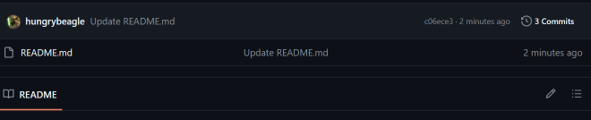
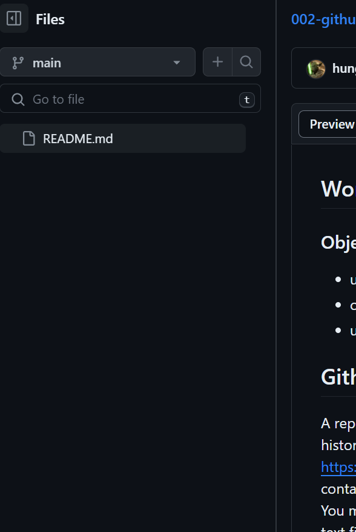

## Working with Github Repositories in the Github Site

### Objectives
* understand what a repository is on github
* clone a repository and edit the files
* use github markup language to format the README.md

## Github Repositories
A repository is the most basic element of GitHub. It's a place where you can store your code, your files, and each file's revision history. Repositories can have multiple collaborators and can be either public or private.
from: https://docs.github.com/en/repositories/creating-and-managing-repositories/about-repositories
Each repository usually contains one project or related group of files. For example you might be building a Flappy Bird Game. That's one repository.  You might be building a text editor. That's also one repository.  You might even be using it to keep just a bunch of recipes in text files. That could also be a repository. A repository doesn't even need to be a program; it can be just text files that you want to organize together.

## Github Files
The github page can be quite busy, but we will focus on a couple of things first.  The files are one of the most important parts of the page, because this is where you can see what is in the repository, or *repo*

This is a graphic of a Github Repo's files shown on the main page.  

This section will also show you how many *commits* (save points) have been made in the project, as well as when each file was last updated.  You can click on the pencil icon to edit or view the file.
Clicking on one of the files will open up the file in another page, which includes a ***File Manager*** on the left side of the page.

Github File Manager  
